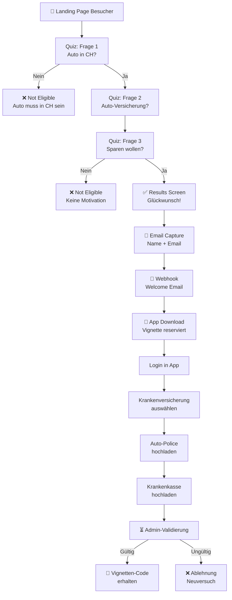

# Finanu Vignette - Optimierter Quiz-Katalog

## 🎯 Neue Frage-Struktur (Optimiert)

### Schritt 1: Auto-Zugelassenheit (Gating-Frage)
**Frage:** Ist dein Fahrzeug aktuell in der Schweiz zugelassen?

| Option | Wert | Ergebnis |
|--------|------|----------|
| Ja | `yes` | ✅ Weiter zu Frage 2 |
| Nein | `no` | ❌ Not Eligible Screen |

**Ziel:** Entfernt unqualifizierte Leads sofort

---

### Schritt 2: Auto-Versicherung (Lead-Qualifizierung)
**Frage:** Wo ist dein Auto versichert?

| Option | Wert | Beschreibung |
|--------|------|----------|
| Allianz | `allianz` | ✅ Qualifiziert |
| AXA | `axa` | ✅ Qualifiziert |
| Generali | `generali` | ✅ Qualifiziert |
| Helvetia | `helvetia` | ✅ Qualifiziert |
| Zurich | `zurich` | ✅ Qualifiziert |
| Mobiliar | `mobiliar` | ✅ Qualifiziert |
| Vaudoise | `vaudoise` | ✅ Qualifiziert |
| Sympany | `sympany` | ✅ Qualifiziert |
| Andere | `other` | ✅ Qualifiziert |

**Ziel:** Erfasst Auto-Versicherung für die Validierung

---

### Schritt 3: Spar-Motivation (Conversion-Trigger)
**Frage:** Möchtest du 40 CHF pro Jahr sparen?

| Option | Wert | Ergebnis |
|--------|------|----------|
| Ja | `yes` | ✅ Results Screen |
| Nein | `no` | ❌ Not Eligible Screen |

**Ziel:** Testet echte Motivation (nicht nur Neugier)

---

## 📊 Neue Validierungslogik

### Quiz-Stage (Landing Page)
```
✅ Auto in CH? → Ja
✅ Auto-Versicherung? → Beliebig (gespeichert)
✅ Sparen wollen? → Ja
= QUALIFIED FÜR VIGNETTE-RESERVIERUNG
```

### Email-Erfassung
- Name + Email speichern
- Webhook: Welcome Email versenden
- Status: "Reserviert für 24h"
- Link zur App zum Download

### App-Stage (Später)
```
1️⃣ User loggt sich ein
2️⃣ Krankenversicherung auswählen (NEU)
3️⃣ Auto-Police hochladen (Foto/PDF)
4️⃣ Krankenkasse-Beleg hochladen
5️⃣ Status: "Zur Prüfung eingereicht"
6️⃣ Admin validiert → Vignetten-Code freigeschaltet
```

---

## 🔄 User Journey (Optimiert)



---

## 💡 Warum diese Optimierung?

| Aspekt | Vorher | Nachher | Vorteil |
|--------|--------|---------|---------|
| **Fragen im Quiz** | 3 (mit Krankenversicherung) | 3 (mit Auto-Versicherung) | Weniger Reibung |
| **Validierungstiefe** | Oberflächlich | Tiefgreifend in App | Bessere Datenqualität |
| **Fraud-Prevention** | Gering | Hoch (2-stufig) | Admin-Review + Docs |
| **User Motivation** | Unbekannt | Getestet | Bessere Conversion |
| **Dropout-Risk** | Hoch (zu viele Fragen) | Niedrig | 3 schnelle Fragen |

---

## 📱 Nächste Schritte im App Dashboard

Nach dem Email-Verify kommt in der App:

### 1. Schritt: Krankenversicherung
```
"Bei welcher Krankenversicherung bist du versichert?"
- CSS
- Helsana
- Swica
- Groupe Mutuel
- Sanitas
- Andere
```

### 2. Schritt: Auto-Police hochladen
```
"Lade ein Foto deiner Fahrzeugversicherungs-Police hoch"
- Camera / Photo
- Datei-Upload (PDF/JPG)
- Dateiprüfung (OCR)
```

### 3. Schritt: Krankenkasse-Beleg
```
"Lade einen Beleg deiner Krankenkasse hoch"
- Insurance Card Foto
- Prämien-Auszug
```

### Status-Verfolgung
```
⏳ Zur Prüfung eingereicht
✅ Validiert
🎉 Vignetten-Code aktiviert
📲 Push-Notification + Email
```

---

## ✅ Implementiert

- ✅ HTML-Fragen angepasst (Auto-Versicherung statt Krankenversicherung)
- ✅ JavaScript-Logik aktualisiert
- ✅ Results Screen: Info über App-Validierung hinzugefügt
- ✅ State Management angepasst

**Die Landing Page ist jetzt optimiert und verzeiht die Admin-Validierung auf die App-Stage!** 🚀
